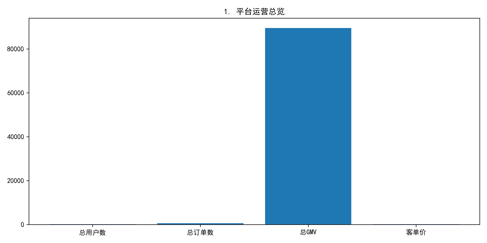
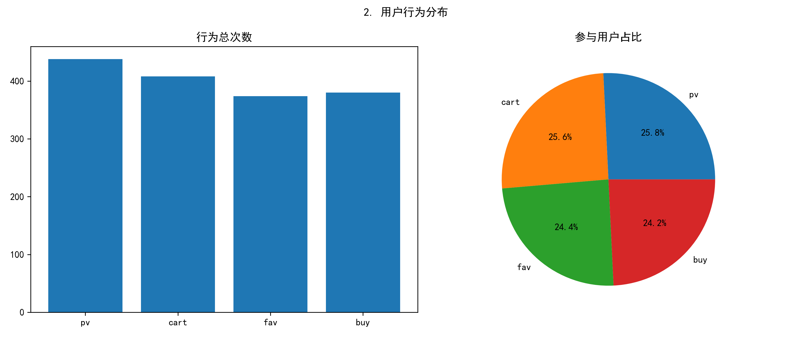
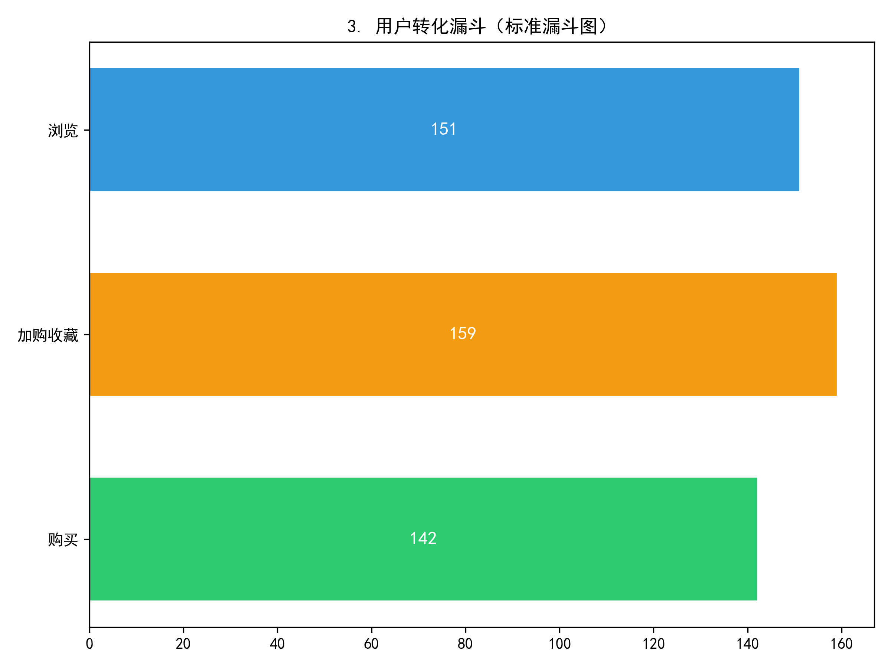
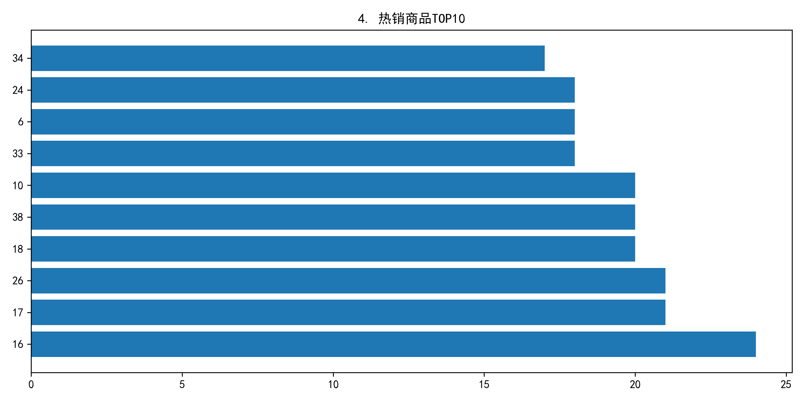
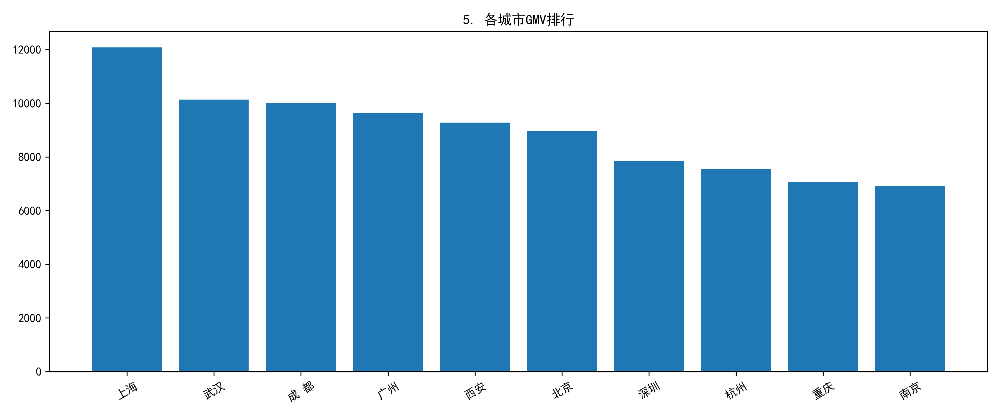
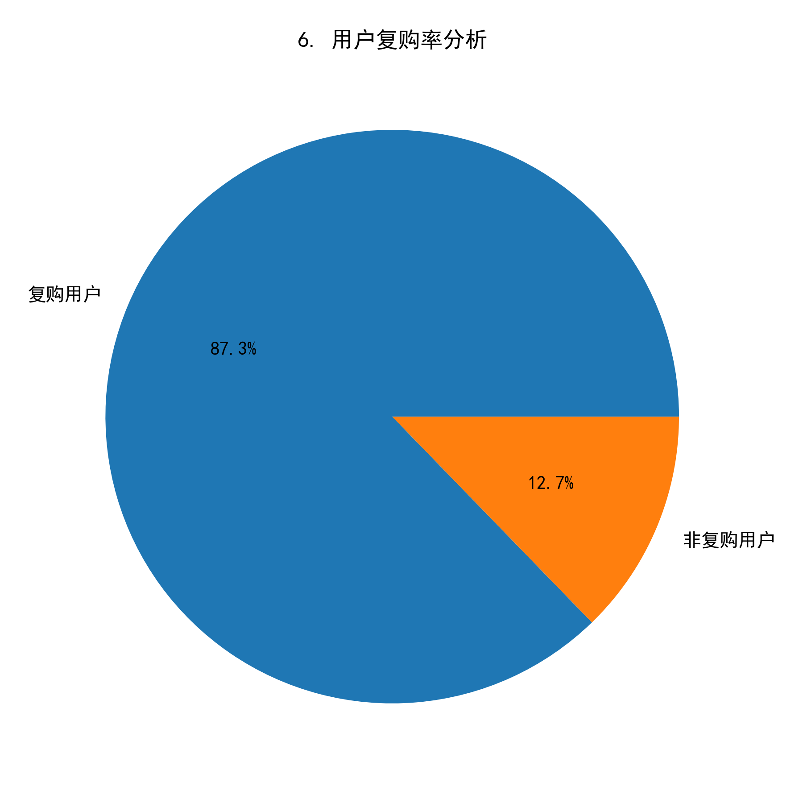
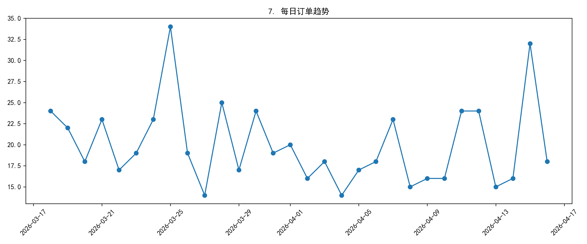

# sql_project_2026_04
基于SQL构建的电商数据分析项目，自建模拟电商数据，包含用户、商品、订单、用户行为四张数据表，通过SQL完成平台总览、用户转化漏斗、热销商品排行、城市消费分析等核心业务指标计算。

# 数据库表
users：160条
items：40条
orders：600条
user_behavior：1800条

# 分析内容
1. 平台总览
2. 用户行为分布
3. 转化漏斗
4. 热销商品TOP10
5. 城市消费GMV
6. 用户复购率
7. 每日订单趋势

# 运行步骤
1. 运行 create_table.sql 建库建表
2. 运行 insert_data.sql 导入数据
3. 运行 analysis.sql 查看分析结果
4.用python对sql查询结果进行可视化，模拟企业Finebi可视化过程

# 对照sql查询结果（result_images)与python可视化结果(visualization_python_charts)进行详细分析
1. 平台总体运营总览

分析：
平台总用户数为160人，总订单数600单，总GMV为89487.57元，客单价为149.15元。
从数据来看，用户人均下单近 4 次，**平台整体规模稳定**，用户粘性较好；同时客单价处于健康区间，说明用户消费能力和平台商品定价匹配，业务基础良好。

3. 用户行为分布统计

分析：
浏览（pv）行为占比最高，说明平台流量基础较好；加购(cart)/收藏(fav)行为占比次之，用户兴趣度较高。

4. 用户转化漏斗分析

分析：
- 浏览用户数：151人
- 加购/收藏用户数：159人（注：部分用户通过外部链接/收藏列表直接进入，未产生显性浏览行为）
- 购买用户数：142人
**整体转化率**为 94%，说明用户从浏览到购买的转化效率较高，用户粘性良好。
浏览→加购/收藏转化率约为105%，主要受外部引流渠道影响；加购/收藏→购买转化率为89%，购买意愿强。

4. 热销商品 TOP10

分析：
**商品16销量最高，说明该类商品用户认可度高**，可作为平台主推款，优化库存与供应链。

5. 各城市消费能力排行

分析：
**上海市GMV最高，是平台核心消费市场**，可针对性投放运营活动，进一步挖掘潜力。

6. 用户复购率分析

分析：
平台**复购率**为87%，用户忠诚度较高，可通过以下方式进一步提升：
- 推出会员专属优惠券、复购积分体系，强化用户留存；
- 针对高频复购用户推送个性化商品推荐，提升客单价。
  
7. 每日订单趋势

分析：
**订单数在2026-03-25日达到峰值**，可能与平台活动/节假日相关，可参考该规律优化后续活动节奏，比如提前备货与投放流量。
